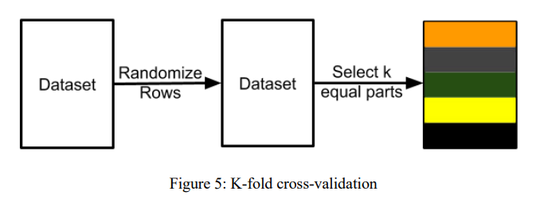
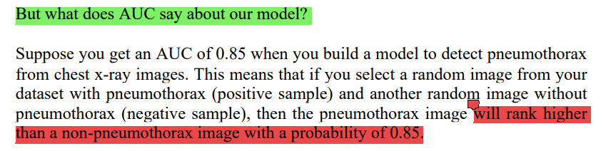
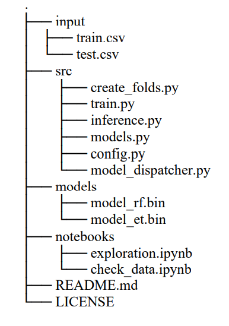
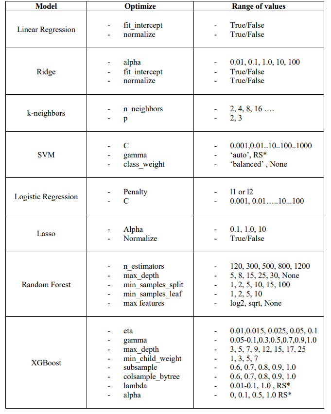

# Cross validation

- To use `stratified k-fold` for a `regression` problem, we have first to divide the target into bins `Number of Bins = 1 + log2(N)`
- If you want to do `feature engineering`, split your data first. If you're going to `build models`, split your data first
- `GroupKFold`
- `StratifiedKFold`
- `StratifiedGroupKFold` (tại thời điểm này sklearn đã có class này hoặc có thể tham khảo https://www.kaggle.com/jakubwasikowski/stratified-group-k-fold-cross-validation)

- skew data thì nên sử dụng `StratifiedKFold`
# Metrics

## 1. classification
- what does AUC say about our model? 
    - mình đã tham khảo khá nhiều bài để hiểu đc ý của tác giả ở trên về: "auc = 0.85 => nếu chọn random 1 positive sample (trong các positive) và random 1 negative sample (trong tập negative) thì xác suất `rank` của positive cao hơn hơn negative = 85%" (link ở [auc-ref.md](auc-ref.md) => mình cũng đã giải thích ở link này)
- AUC is a widely used metric for skewed binary classification tasks

- multi-class classification:
    - Macro averaged precision: tính precision for all classes individually => then average them
    - Micro averaged precision: tính class wise true positive and false positive and then use that to calculate overall precision
    - Weighted precision: same as macro but in this case, it is weighted average depending on the number of items in each class

- multi-label classification (vd trong bài toán object detection):
    - Precision at k (P@k) => của 1 sample tại k
    - Average precision at k (AP@k) => của 1 sample, vd AP@3, we calculate P@1, P@2 and P@3 and then divide the sum by 3.  
    - Mean average precision at k (MAP@k) => mean AP@k của toàn bộ data
    - Log loss

## 2. regression
advanced metrics:
- QWK => tính sự gần nhau giữa pred và true theo khoảng cách (thường là ratings) => vd label là 1, nhưng pred là 3 thì sẽ ko tốt bằng pred 2
- Matthew’s Correlation Coefficient (MCC) => MCC ranges from -1 to 1. 1 is perfect prediction, -1 is imperfect prediction, and 0 is random prediction. => MCC takes into consideration TP, FP, TN and FN and thus can be used for problems where classes are skewed.

# sample machine learning projects

# Feature selection

- tham khảo: https://www.kaggle.com/arthurtok/feature-ranking-rfe-random-forest-linear-models#INTRODUCTION

## RFE
- explain: https://www.linkedin.com/pulse/what-recursive-feature-elimination-amit-mittal/ 
    - từ bài này mình có 1 câu hỏi: sao tác giả tách backward elimination và RFE??? chúng có khác nhau k??? => ko khác nhau: https://stats.stackexchange.com/questions/450518/rfe-vs-backward-elimination-is-there-a-difference
- how RFECV works?: https://www.quora.com/scikit-learn-How-does-RFECV-make-use-of-cross-validation
- sklearn:
    - user guide => explain rfe và rfecv để làm gì:https://scikit-learn.org/stable/modules/feature_selection.html#rfe
    - vd sử dụng rfecv để tìm optimal n_features: https://scikit-learn.org/stable/auto_examples/feature_selection/plot_rfe_with_cross_validation.html#sphx-glr-auto-examples-feature-selection-plot-rfe-with-cross-validation-py

# Hyperparameter optimization

- GridsearchCV & RandomSearchCV => 
- `scikit-optimize (skopt)` uses `Bayesian optimization` with `gaussian process` can be accomplished by using `gp_minimize function`
- `hyperopt` uses `Tree-structured Parzen Estimator (TPE)` to find the most optimal parameters
=> `optimization function` return `negative accuracy` cause we cannot minimize the accuracy, but we can minimize it when we multiply it by -1.

RS* implies random search should be better

- tham khảo: https://neptune.ai/blog/hyperparameter-tuning-on-any-python-script

