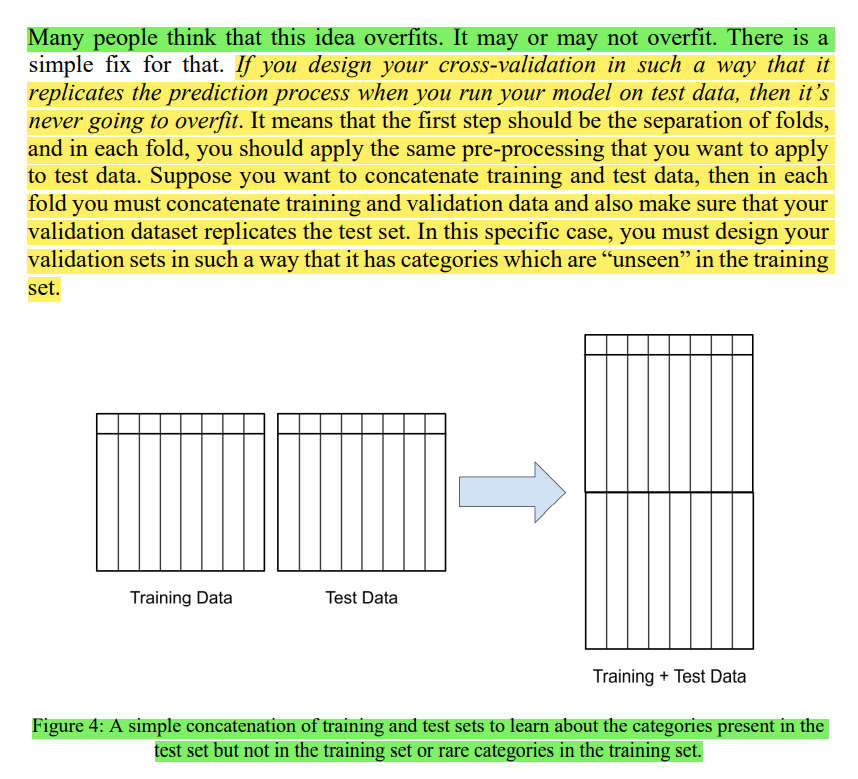
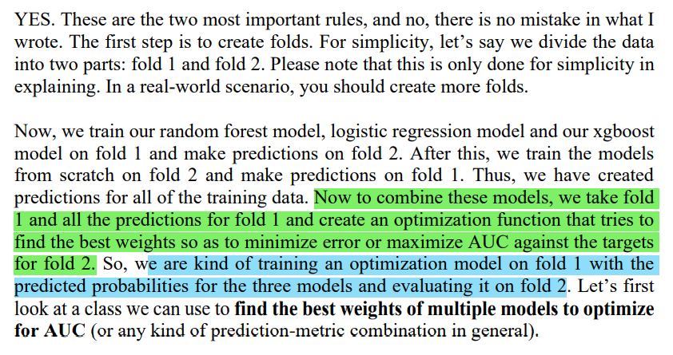

# Cross validation

- To use `stratified k-fold` for a `regression` problem, we have first to divide the target into bins `Number of Bins = 1 + log2(N)`
- If you want to do `feature engineering`, split your data first. If you're going to `build models`, split your data first
- `GroupKFold`
- `StratifiedKFold`
- `StratifiedGroupKFold` (tại thời điểm này sklearn đã có class này hoặc có thể tham khảo https://www.kaggle.com/jakubwasikowski/stratified-group-k-fold-cross-validation)

- skew data thì nên sử dụng `StratifiedKFold`
# Metrics

## 1. classification
- what does AUC say about our model? 
    - mình đã tham khảo khá nhiều bài để hiểu đc ý của tác giả ở trên về: "auc = 0.85 => nếu chọn random 1 positive sample (trong các positive) và random 1 negative sample (trong tập negative) thì xác suất `rank` của positive cao hơn hơn negative = 85%" (link ở [auc-ref.md](auc-ref.md) => mình cũng đã giải thích ở link này)
- AUC is a widely used metric for skewed binary classification tasks

- multi-class classification:
    - Macro averaged precision: tính precision for all classes individually => then average them
    - Micro averaged precision: tính class wise true positive and false positive and then use that to calculate overall precision
    - Weighted precision: same as macro but in this case, it is weighted average depending on the number of items in each class

- multi-label classification (vd trong bài toán object detection):
    - Precision at k (P@k) => của 1 sample tại k
    - Average precision at k (AP@k) => của 1 sample, vd AP@3, we calculate P@1, P@2 and P@3 and then divide the sum by 3.  
    - Mean average precision at k (MAP@k) => mean AP@k của toàn bộ data
    - Log loss

## 2. regression
advanced metrics:
- QWK => tính sự gần nhau giữa pred và true theo khoảng cách (thường là ratings) => vd label là 1, nhưng pred là 3 thì sẽ ko tốt bằng pred 2
- Matthew’s Correlation Coefficient (MCC) => MCC ranges from -1 to 1. 1 is perfect prediction, -1 is imperfect prediction, and 0 is random prediction. => MCC takes into consideration TP, FP, TN and FN and thus can be used for problems where classes are skewed.


# sample machine learning projects


```
nếu target là skewed thì dùng thường stratifiedkfold và metrics là auc
```

- trong bài toán sử dụng deeplearning, tác giả thường dùng:
    - `dataset.py` => class dataset
    - `engine.py` => train và evaluate func cho từng epoch
    - `model.py` => model architecture
    - `train.py` => code để traintrain
# categorical variables
## 1. preprocess categorical featuresfeatures
- check và xử lý NaN values first (this is very important!)
    - để xử lý NaN có 1 số pp: drop, constant,... hoặc build 1 model đơn giản để predict NaN values dựa trên các features khác
- đối vs norminal variable => labelencoder (đúng hơn là ordinal encoder) có thể sử dụng trực tiếp trong tree-based model, còn vs linear/svm/nn thì có thể dùng onehot, binarize (nhị phân) (onehot khi save ở dạng sparse tiết kiệm đc nhiều dung lượng hơn nhị phân => onehot thường đc sử dụng hơn nhị phân) hoặc hashing 
- count (có thể count riêng feature đó, hoặc kết hợp vs các feature khác khi count)
- tạo feature mới bằng cách concat các cat features (phụ thuộc vào domain knowledge, hoặc có thể sử dụng greedy apporach)
- có thể gộp các categories thành `rare category` nếu các nhóm đó quá ít so vs phần còn lại
- `We can also try reducing the sparse one-hot encoded matrices using singular value decomposition. This is a very common method of extracting topics in natural language processing.` => trước đây mình đã thắc mắc sau khi one-hot có thực hiện pca hay svd đc ko? như vậy ở đây là đc

```
Please note that we do not need to normalize data when we use tree-based models. This is, however, a vital thing to do and cannot be missed when we are using linear models such as logistic regression
```

-  `target encoding`: However, you have to be very careful here as this might overfit your model. Target encoding is a technique in which you map each category in a given feature to its mean target value, but this must always be done in a cross-validated manner
    - Target encoding for unseen test data can be derived from the full training data or can be an average of all the 5 folds. (vì ở mỗi fold sẽ có target encoding khác nhau)
    - When we use target encoding, it’s better to use some kind of smoothing or adding noise in the encoded values. Scikit-learn has contrib repository which has target encoding with smoothing, or you can create your own smoothing. Smoothing introduces some kind of regularization that helps with not overfitting the model. It’s not very difficult
- entity embedding


## 2. category có trong test, ko có trong train
- chú ý vấn đề các category k có trong train nhưng có trong test set => nếu trong live setting, có thể xử lý bằng cách: `RARE` cho unseen value, `NONE` cho missing value
- `If you have a fixed test set, you can add your test data to training to know about the categories in a given feature => This will also take care of rare values that appear very less number of times in training data but are in abundance in test data. Your model will be more robust.` (vẫn chưa thực sự hiểu ý này)
    - 
    - `If you design your cross-validation in such a way that it replicates the prediction process when you run your model on test data, then it’s never going to overfit.` => ý này có thể hiểu như thế nào? theo vd của tác giả, mình hiểu là nếu lúc predict, cần gộp cả train và test vào để thực hiện encode thì lúc train/valid cũng gộp cả train và valid để encode => nhưng điều này dẫn đến 1 câu hỏi: "chẳng lẽ khi thực hiện test mình fit 1 encoder khác thay vì dùng encoder tạo trước đó? hay mình cần tạo 1 encoder trước cho train+test và dùng lúc cross-validation?" => theo mình nghĩ thì sẽ cần tạo 1 encoder trước cho train+test => liệu cả đoạn này có thể hiểu đơn giản là gộp cả train+test vào và fit encoder khi preprocessing k? vì bản chất
    - `.....and also make sure that your validation dataset replicates the test set. In this specific case, you must design your validation sets in such a way that it has categories which are “unseen” in the training set` => nghĩa là khi chia valid set cần đc thiết kế sao cho tập valid cũng có những category mà train ko có


# Feature engineering
## 1. create feature
`Feature engineering is not just about creating new features from data but also includes different types of normalization and transformations`
- date and time data:
    - basic: Year, Week of year, Month, Day of week, Weekend, Hour,...
    - aggregate features: vd như số lần mua trong tháng, trong tuần,...
    - => có thể tham khảo lib `tsfresh` để tạo feature cho time-series data (https://tsfresh.readthedocs.io/en/latest/)
- polynomial features
- binning => When you bin, you can use both the bin and the original feature. Binning also enables you to treat numerical features as categorical
- log transformation, exponential,... (khi sử dụng metrics log như RMSLE => có thể train vs log target, khi predict thì revert lại => như vậy sẽ optimize đc model theo metrics đó)

```
And always remember to scale or normalize your features if you are using linear models like logistic regression or a model like SVM. Tree-based models will always work fine without any normalization of features.
```

## 2. mising value
- `categorical features`: let’s keep it super simple. If you ever encounter missing values in categorical features, treat is as a new category!, or most freq,..
- `numerical data`: choose a value that does not appear in the specific feature and fill using that. For example, let’s say 0 , or median, mean,...
- A fancy way of filling in the missing values would be to use a k-nearest neighbour method (có implement trong sklearn: `KNNImputer`)
- Another way of imputing missing values in a column would be to train a regression model that tries to predict missing values in a column based on other columns 
- Always rememberthat imputing values for tree-based models is unnecessary as they can handle it themselves

# Feature selection

## 1. basic
- remove features with very low variance => vì low variance thì thì ít có khả năng là feature tốt
```
from sklearn.feature_selection import VarianceThreshold
```
- remove features which have a high correlation sử dụng corr
- `Univariate feature selection` is nothing but a `scoring` of each `feature` against a given `target`. `Mutual information`, `ANOVA F-test` and `chi2` are some of the most popular methods for univariate feature selection
```
SelectKBest or SelectPercentile in sklearn
```
tuy nhiên, most of the time, people prefer doing feature selection using a machine learning model thay vì `univariate feature selection`

## 2. `greedy` feature selection using model
chú ý đây là `greedy` nên kqua tìm đc có thể ko fai tối ưu 

### 2a. simple greedy
- In greedy feature selection, the first step is to choose a model. 
- The second step is to select a loss/scoring function.
- And the third and final step is to iteratively evaluate each feature and add it to the list of “good” features if it improves loss/score

### 2b. RFE
- ngược vs cách trên => we start with all features and keep removing one feature in every iteration that provides the least value to a given model. 
```
if we use models like linear support vector machine (SVM) or logistic regression, we get a coefficient for each feature which decides the importance of the features. In case of any tree-based models, we get feature importance in place of coefficients
```

- explain: https://www.linkedin.com/pulse/what-recursive-feature-elimination-amit-mittal/ 
    - từ bài này mình có 1 câu hỏi: sao tác giả tách `backward elimination` và `RFE`??? chúng có khác nhau k??? => ko khác nhau: https://stats.stackexchange.com/questions/450518/rfe-vs-backward-elimination-is-there-a-difference
- how `RFECV` works?: https://www.quora.com/scikit-learn-How-does-RFECV-make-use-of-cross-validation
- sklearn:
    - user guide => explain rfe và rfecv để làm gì:https://scikit-learn.org/stable/modules/feature_selection.html#rfe
    - vd sử dụng `rfecv` để tìm optimal n_features: https://scikit-learn.org/stable/auto_examples/feature_selection/plot_rfe_with_cross_validation.html#sphx-glr-auto-examples-feature-selection-plot-rfe-with-cross-validation-py

## 3. select feature from other model
- You can choose features from one model and use another model to train (For example, you can use Logistic Regression coefficients to select the features and then use Random Forest to train the model on chosen features). 
- `Scikit-learn` also offers `SelectFromModel` class that helps you choose features directly from a given model.

- ngoài ra có thể sử dụng những model có dùng L1-regularization, vì khi dùng L1, coef của các features k qtrong sẽ ~ 0 => có thể loại bỏ

## tham khảo
- https://www.kaggle.com/arthurtok/feature-ranking-rfe-random-forest-linear-models#INTRODUCTION


# Hyperparameter optimization

- GridsearchCV & RandomSearchCV => gridsearch ít đc dùng
- `scikit-optimize (skopt)` uses `Bayesian optimization` with `gaussian process` can be accomplished by using `gp_minimize function`
- `hyperopt` uses `Tree-structured Parzen Estimator (TPE)` to find the most optimal parameters
=> `optimization function` return `negative accuracy` cause we cannot minimize the accuracy, but we can minimize it when we multiply it by -1.

RS* implies random search should be better

- tham khảo: https://neptune.ai/blog/hyperparameter-tuning-on-any-python-script

# image classification & segmentation

## 1. basic
```
classic case of skewed binary classification. Therefore, we choose the evaluation metric to be AUC and go for a stratified k-fold cross-validation scheme
```

- Pooling is faster than convolution and is a way to down-sample the image. Max pooling detects edges and average pooling smoothens the image
- ảnh fai đc convert sang `RGB`
    - tham khảo: 
    ```
    https://www.kaggle.com/sontt227/cassava-ensemble-model 
    https://github.com/jwyang/faster-rcnn.pytorch/issues/10 
    https://discuss.pytorch.org/t/input-format-for-pretrained-torchvision-models/48759
    https://discuss.pytorch.org/t/whats-the-channel-order-of-images-for-resnet-model-in-model-zoo/1017
    https://github.com/datitran/object_detector_app/issues/29
    ```
- thử smaller model trước (vd sử dụng resnet18 trước khi thử resnet50,...)
- up-convolution is not the same as up-sampling. Up-sampling is an easy process in which we apply a function to an image to resize it. In up-convolution, we learn the filters => trong U-Net, Some prefer to use bilinear sampling instead of transposed convolutions for up-sampling, but that’s not the real implementation of the paper. It might, however, perform better
- In segmentation problems you can use a variety of loss functions, for example, pixel-wise binary cross-entropy, focal loss, dice loss etc.

```
các lib về cv cho pytorch: timm (pytorch image models) và smp (segmentation models - https://github.com/qubvel/segmentation_models.pytorch)
ngoài ra có thể sử dụng lib wtfml của tác giả để ko fai viết lại các hàm train, evaluate,.. của pytorch (https://github.com/abhishekkrthakur/wtfml)
```

## 2. advance code: (page 215-220)
- sử dụng mixed precision training
```
from apex import amp
.....

tk0 = tqdm(data_loader, total=num_batches)
for d in tk0:
    .....
    # backward loss is calculated on a scaled loss
    # context since we are using mixed precision training
    # if you are not using mixed precision training,
    # you can use loss.backward() and delete the following
    # two lines of code
    with amp.scale_loss(loss, optimizer) as scaled_loss:
        scaled_loss.backward()
```

- sử dụng nhiều GPU
```
# if we have more than one GPU, we can use both of them!
if torch.cuda.device_count() > 1:
    print(f"Let's use {torch.cuda.device_count()} GPUs!")
    model = nn.DataParallel(model)
```

# text classification/regression
- CountVectorizer
- TfidfVectorizer/ TfidfTransformer (tốt hơn CountVectorizer)
- stemming and lemmatizations
- topic extraction: using non-negative matrix factorization (NMF) or latent semantic analysis (LSA), which is also popularly known as singular value decomposition or SVD
=> You can fit any of these on sparse matrix obtained from CountVectorizer or TfidfVectorizer => có thể sử dụng sau khi thực hiện BoW (countvetorizer) hoặc tf-idf
- sử dụng regex để clean data
- remove stopwords
- word embedding: word2vec, glove, fasttext => When you use pretrained embeddings, try to see for how many words you are not able to find embeddings and why. The more words for which you have pre-trained embeddings, the better are the results.
- transformer: Please note that these transformers are hungry in terms of computational power needed to train them. LSTMs, and they are much simpler, easier to train and faster when it comes to inference => nên cân nhắc chọn transformer hay model khác tùy vào tình huống, vì transformer cho kết quả tốt hơn nhưng đánh đổi lại là train lâu hơn, inference lâu hơn

# ensembling and stacking
- vote
- mean/ weight probabilities
- ranks of their probabilities => This type of combination works quite good when the concerned metric is the area under curve as AUC is all about ranking samples.
    - technique này đọc code thì mình đang hiểu là tính mean xếp hạng probas của toàn bộ model, nhưng chưa hiểu áp dụng thì sẽ lấy cái rank cao nhất?
    ```
    def rank_mean(probas):
        """
        Create mean predictions using ranks
        :param probas: 2-d array of probability values
        :return: mean ranks
        """
        ranked = []
        for i in range(probas.shape[1]):
            rank_data = stats.rankdata(probas[:, i]) # => xét từng model, xác định rank theo proba của từng class (https://docs.scipy.org/doc/scipy/reference/generated/scipy.stats.rankdata.html)
            ranked.append(rank_data) # => append rank vừa tính ở trên, vì vậy ranked sẽ là list rank của các model
        ranked = np.column_stack(ranked)
        return np.mean(ranked, axis=1) # => tính mean rank
    ```

- stacking /blending

## how to find best weight of each models for ensemble?
- The first rule of ensembling is that you always create folds before starting with ensembling. and The second rule of ensembling is that you always create folds before starting with ensembling
- vd sau khi chia `2` fold, train `3` model ở fold 1 và predict ở fold 2 => sử dụng predict ở fold 1 và target ở fold 1 để train optimize model, sau đó evaluate ở fold2, và làm tương tự khi train fold 2 và predict fold 1 

- sử dụng phương pháp tương tự như việc tìm hyperparameters tốt nhất => sử dụng `optimize function`, tìm cách `MINIMIZE` nó (vì vậy fai dùng negative auc)  bằng cách sử dụng `scipy fmin` (tham khảo page 275-277)


# reproducible code & model serving
- tham khảo cách sử dụng `docker`, `docker-compose` (ở đây tác giả dùng docker-compose cho 1 service để ko fai nhớ bash script run docker)
- `multiple processes` for the API using `Gunicorn` => can serve many customers at once
```
$ gunicorn api:app --bind 0.0.0.0:5000 --workers 4
```