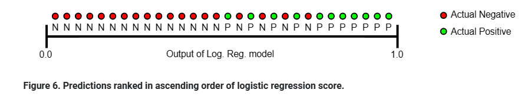
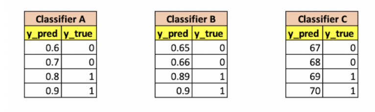

"auc = 0.85 => nếu chọn random 1 positive sample (trong các positive) và random 1 negative sample (trong tập negative) thì xác suất `rank` của positive cao hơn hơn negative = 85%"

=> ở đây có 2 ý cần giải thích:
- `rank` là gì? sao rank của positve sample cao hơn rank của negative sample?
- nếu chọn random 1 positive sample (trong các positive) và random 1 negative sample (trong tập negative) thì xác suất `rank` của positive cao hơn hơn negative = 85%?
- ngoài ra có 1 ý thứ 3, tác giả nói ở bài ensemble: "AUC chỉ quan tâm tới rank, nên sum_of_weight của các model ko cần fai = 1" => chỉ quan tâm tới rank là sao? sao sum_of_weigt <> 1 cũng đc trong khi bth ensemble có sum_of_weight = 1

=> để trả lời các câu hỏi trên, mình đã đọc các link sau để xem có thêm thông tin gì về auc ko
- https://www.noron.vn/post/tim-hieu-chi-tiet-ve-auc---roc-trong-machine-learning-1fz9nhqo5ut
- https://phamdinhkhanh.github.io/2020/08/13/ModelMetric.html
- https://towardsdatascience.com/understanding-auc-roc-curve-68b2303cc9c5

tuy nhiên để hiểu đc ý của tác giả, nên đọc:
- https://builtin.com/data-science/roc-curves-auc
- https://developers.google.com/machine-learning/crash-course/classification/roc-and-auc

ngoài ra có thể tham khảo thêm (chưa đọc nhưng có vẻ nên tham khảo):
- https://towardsdatascience.com/choosing-the-right-metric-is-a-huge-issue-99ccbe73de61
- https://www.dataschool.io/roc-curves-and-auc-explained/
- https://stats.stackexchange.com/questions/180638/how-to-derive-the-probabilistic-interpretation-of-the-auc

# `rank` là gì? sao rank của positve sample cao hơn rank của negative sample?
- `rank` đơn giản là sắp xếp các sample theo thứ tự của y_pred thôi, vd như ảnh 
- `rank của positve sample cao hơn rank của negative sample?` => thông thường pos có y_prob ~ 1, còn neg có prob ~ 0 => vì vậy nếu sắp xếp theo thứ tự của y_prob, thông thường pos sẽ đứng cao hơn neg => nếu model hoàn hảo (auc = 1 hoặc có thể auc=0) thì toàn bộ pos sẽ nằm về 1 phía, neg sẽ nằm về phía ngược lại

# nếu chọn random 1 positive sample (trong các positive) và random 1 negative sample (trong tập negative) thì xác suất `rank` của positive cao hơn hơn negative = 85% là sao?

để hiểu đơn giản ý này, có thể xem trường hợp AUC < 1 (mình giả sử AUC = 0.85)  

=> từ hình có thể thấy, sẽ có trường hợp mà sample neg có y_prob > y_prob của pos

=> auc = 0.85 có nghĩa làlà xác suất mình chọn 1 cái màu xanh có vị trí cao hơn (gần phía 1 hơn) xác suất mình chọn 1 cái màu đỏ là 85%, xác suất 15% là trường hợp mà chọn ra sample neg có vị trí cao hơn pos

# auc chỉ quan tâm tới rank là sao? sao sum_of_weigt <> 1 cũng đc trong khi bth ensemble có sum_of_weight = 1

- có thể xem vd trong bài https://builtin.com/data-science/roc-curves-auc
 

từ hình có thể thấy, có thể chọn threshold of 0.75 for Classifier A, 0.7 for Classifier B and 68.5 for Classifier C => như vậy sẽ có AUC = 1 => như vậy chỉ cần quan tâm đến sắp xếp y_pred của các sample neg và pos => nếu pos và neg nằm về 2 phía ngược nhau thì auc sẽ cao, bất kể y_pred (như ảnh ở trên) là bnh đi nữa

=> sum_of_weight = 1 ko fai là bắt buộc, vì ko nhất thiết y_pred fai ~ 1 cho pos, và của neg fai ~ 0 nữa (có thể neg là 0.5, pos là 70 cũng ok mà)